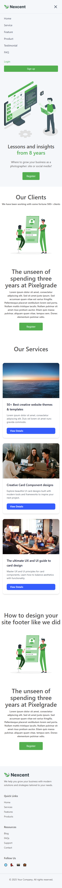

# 🌐 React Home Page

A modern, responsive **React + Tailwind CSS** homepage with navigation, hero section, content sections, cards, and footer.  
Designed to be clean, mobile-friendly, and easy to customize.  

---

## 🚀 Features
- ✅ Responsive Navbar with login/signup buttons  
- ✅ Hero section with image and CTA button  
- ✅ Content + Image section (flex with responsiveness)  
- ✅ Card grid with hover effects  
- ✅ Modern Footer with quick links & social icons  
- ✅ Built with **React + Tailwind CSS**  

---

## 📸 Screenshots

<p align="center">
  
</p>

<p align="center">
  
</p>

<p align="center">
  
</p>

---

## 🛠️ Installation & Setup

1. Clone the repository:
   ```bash
   git clone https://github.com/your-username/your-repo-name.git
   cd your-repo-name
